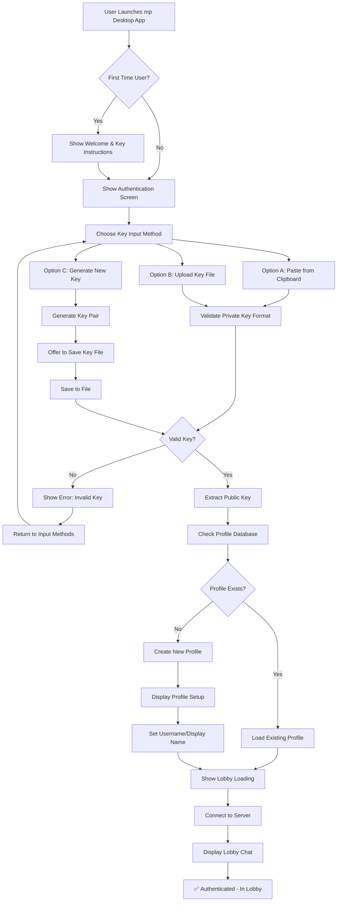
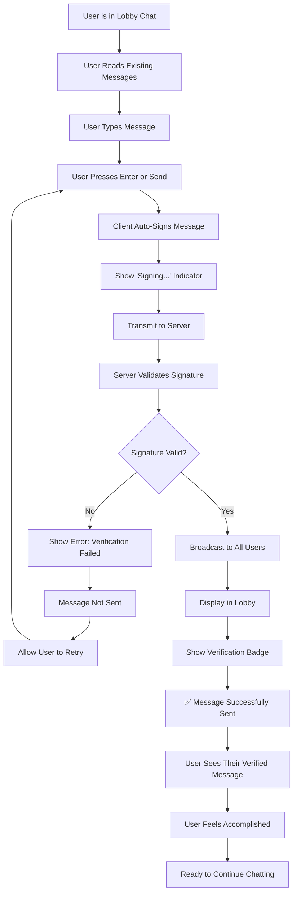
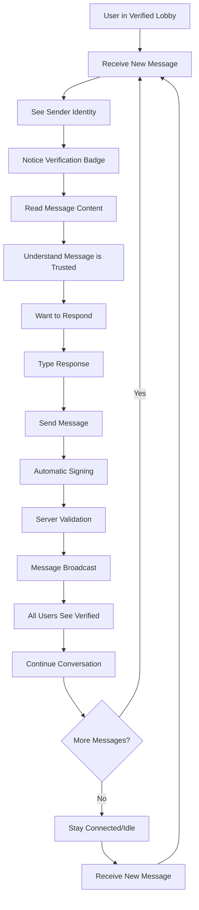

# UX Design Specification mp

**Author:** Riddler
**Date:** 2025-12-22

---

<!-- UX design content will be appended sequentially through collaborative workflow steps -->

## Executive Summary

### Project Vision

A Web3-native chat application that eliminates traditional account creation entirely. Users authenticate using only their private key, with deterministic signatures proving ownership of their public key. The lobby chat features real-time communication where every message is cryptographically verified, creating a trust layer that traditional chat applications cannot provide.

### Target Users

**Primary Users:**
- Web3 developers and enthusiasts seeking trustworthy communication
- Users frustrated with traditional chat apps where anyone can impersonate anyone else
- Crypto-savvy users who want cryptographic identity verification
- Users seeking zero-friction onboarding without sign-up processes

**User Context:**
- Problem: Traditional chat apps allow impersonation and require account creation
- Frustration: Friction in account creation, inability to verify identity
- Solution appeal: Cryptographic proof of identity, immediate access
- Tech level: Web3-literate users comfortable with cryptographic concepts
- Usage: Web browsers, real-time communication

### Key Design Challenges

**1. Cryptographic UX Simplification**
Making private key authentication approachable and not intimidating to users who may be new to Web3 concepts. The interface must guide users through the authentication process without overwhelming them with technical details.

**2. Trust Visualization**
Designing clear, understandable visual indicators for cryptographic verification. Users need to immediately understand that messages are cryptographically verified and trust the system.

**3. Zero-Friction Flow**
Creating seamless authentication and onboarding experience without traditional account creation. The entire flow from landing to participating in chat should be intuitive and fast.

**4. Identity Display**
Balancing cryptographic accuracy with user-friendly display. The system must show both the cryptographic proof (public key) and user-friendly identifiers (usernames) effectively.

### Design Opportunities

**1. Trust Through Design**
Visual design that makes cryptographic verification feel trustworthy and accessible. Use design patterns that communicate security and authenticity without technical jargon.

**2. Educational Moments**
Opportunities to teach users about Web3 identity in context. Subtle tooltips and visual cues that help users understand the value of cryptographic verification.

**3. Competitive Differentiation**
Clean, modern design that contrasts with complex Web3 tools. Position as the "easy way" to use Web3 identity without the typical complexity.

## Core User Experience

### Defining Experience

**Core User Action:** The most frequent action is sending and viewing cryptographically verified messages in the real-time lobby chat. This is the primary value-delivering interaction that users return to repeatedly.

**Critical Interaction:** Private key authentication is absolutely critical to get right. This is the make-or-break moment where users either embrace Web3-native identity or find it too complex.

**Effortless Element:** Understanding that messages are cryptographically verified should feel completely natural and require zero thought. The verification should be visible and trustworthy without requiring users to understand the underlying cryptography.

**Primary Value Loop:** The moment users see their first message with a cryptographic verification badge - this is where the value becomes clear and everything else follows naturally.

### Platform Strategy

**Server:** WSL/Linux backend infrastructure
- Handles real-time communication (WebSocket or similar)
- Stores profile database (public key to username mappings)
- Validates cryptographic signatures
- Manages user presence and lobby state

**Client:** Windows desktop GUI application
- Provides familiar desktop application experience
- Handles private key operations locally (security)
- Integrates with Windows clipboard for key management
- Displays real-time chat with cryptographic verification

**Interaction Model:** Desktop GUI with persistent real-time connection to Linux server
- Native Windows desktop application (not browser-based)
- Real-time lobby updates and messaging
- Local cryptographic operations for security
- Server-side signature validation and user management

### Effortless Interactions

**Natural Actions:**
- Viewing verified messages should feel like any modern chat application
- Seeing cryptographic verification badges should be intuitive and trustworthy
- Understanding identity without reading technical documentation

**Eliminated Friction:**
- No account registration or password creation
- No email verification or account management
- No centralized identity provider dependencies
- No recovery processes (your private key is your identity)

**Platform-Specific Flow:**
- Desktop app launch → immediate understanding of purpose
- Clipboard-based private key input (natural Windows workflow)
- Real-time lobby updates feel immediate and responsive
- Signature verification visible through clean UI design

**Competitor Comparison:**
- Traditional chat: Skip registration entirely
- Web3 chat: Simplify cryptography behind familiar UX patterns
- All platforms: Eliminate account management overhead

### Critical Success Moments

**The "Better" Moment:** Users realize 'this is better' when they see their first message appear with a cryptographic verification badge, understanding instantly that this message cannot be impersonated or forged.

**User Success:** Users feel accomplished when they successfully authenticate using their private key and send their first signed message, experiencing Web3-native identity without complexity.

**Make-or-Break Flow:** The authentication flow (private key → public key extraction → lobby access) must work flawlessly. Any friction here ruins the entire experience.

**First-Time Success:** The sequence of launching the app → authenticating → seeing the lobby → sending a verified message must be intuitive and complete within the 10-second authentication requirement.

**Trust Building:** The moment users understand that every message is cryptographically verified creates the core value proposition and differentiates mp from all traditional chat applications.

### Experience Principles

**1. Instant Access**
Users can participate in the lobby immediately without account creation, registration, or onboarding flows. The path from launch to first message should be as fast as possible while maintaining security.

**2. Visual Trust**
Cryptographic verification is communicated through clear visual design rather than technical details. Users trust the system because they can see verification badges, not because they understand cryptography.

**3. Familiar Feel**
The desktop application UX follows Windows conventions and doesn't feel intimidating or complex. Despite using advanced cryptography, the interface feels as approachable as any standard chat application.

**4. Real-time Clarity**
All interactions feel immediate and trustworthy. Users see lobby updates, message delivery, and verification displays in real-time without delays or uncertainty.

## Desired Emotional Response

### Primary Emotional Goals

**Core Emotional Vision:** Users should feel **empowered and confident** when using mp. The primary emotional goal is creating a sense of empowerment through cryptographic identity - users feel in control of their digital identity without needing to trust centralized authorities.

**Supporting Emotional States:**
- **Trust:** Users trust that every message is cryptographically verified and authentic
- **Excitement:** Users are excited about experiencing Web3-native identity without complexity
- **Accomplishment:** Users feel accomplished when they successfully use private key authentication
- **Confidence:** Users feel confident in the security and authenticity of communications

**Differentiation from Competitors:** Unlike traditional chat apps where users must trust the platform, mp users feel **empowered** by cryptographic verification. This creates a unique emotional experience of self-sovereign identity.

### Emotional Journey Mapping

**Discovery:** Users feel curiosity and intrigue when first learning about Web3-native chat with cryptographic verification.

**Onboarding:** During authentication, users should feel confident rather than overwhelmed by the cryptographic nature of the system.

**Core Experience:** While using the lobby and sending messages, users feel trust in message authenticity and excitement about the unique verification system.

**Accomplishment:** After successfully sending their first verified message, users feel accomplished and impressed by the simplicity of Web3-native identity.

**Return Usage:** When returning to the application, users feel familiar and comfortable, like any trusted chat application, but with added confidence in the cryptographic trust layer.

**Error Scenarios:** If issues occur, users should feel guided and supported rather than confused or frustrated. Clear messaging helps maintain confidence even during problems.

### Micro-Emotions

**Critical Micro-Emotion States:**

- **Confidence vs. Confusion:** Users must feel confident in the authentication flow and message verification. We avoid confusion through clear visual indicators and familiar UX patterns.

- **Trust vs. Skepticism:** Users should trust the verification system immediately. Skepticism is countered through visible cryptographic proof and reliable verification displays.

- **Excitement vs. Anxiety:** Users are excited about Web3 capabilities without anxiety about complexity. The interface makes advanced cryptography feel approachable.

- **Accomplishment vs. Frustration:** Users feel accomplished using private key authentication successfully. Frustration is avoided through streamlined flows and clear guidance.

- **Delight vs. Satisfaction:** Users are delighted by the moment of seeing their first verified message. Satisfaction comes from the reliable, trustworthy experience.

- **Belonging vs. Isolation:** Users feel part of an innovative Web3 community without isolation from technical complexity.

### Design Implications

**Emotion-Design Connections:**

- **Confidence** → Clear visual verification badges, straightforward authentication flow, familiar Windows desktop patterns
- **Trust** → Cryptographic proof displayed prominently, consistent verification indicators, reliable real-time updates
- **Excitement** → Instant access without registration barriers, immediate lobby participation, visible "first verified message" moment
- **Accomplishment** → Successful private key authentication, smooth onboarding to chat, clear confirmation of verified message sending

**Negative Emotions to Avoid:**
- Confusion from technical jargon or complex cryptographic concepts
- Anxiety about handling private keys or making mistakes
- Frustration from authentication delays or verification failures
- Isolation from feeling like the system is too complex or exclusive

**Delight Moments:**
- The instant verification badge appears on first message
- Real-time lobby updates feel immediate and responsive
- Successful authentication completes quickly (within 10 seconds)
- Users realize they participated without creating an account

### Emotional Design Principles

**1. Empowerment Through Simplicity**
Complex cryptography is hidden behind simple, intuitive interfaces. Users feel powerful using Web3-native identity without needing to understand the technical complexity.

**2. Visual Trust Indicators**
Trust is built through clear visual design rather than technical explanations. Verification badges, checkmarks, and status indicators communicate security and authenticity.

**3. Confidence-Building Flows**
Every interaction is designed to build user confidence rather than create doubt. Clear feedback, immediate responses, and reliable verification create a trustworthy experience.

**4. Delight in Verification**
The cryptographic verification system becomes a source of delight rather than complexity. Users enjoy seeing verified messages and understanding the unique value proposition.

## UX Pattern Analysis & Inspiration

### Inspiring Products Analysis

**Discord - Real-Time Communication Excellence**

Discord exemplifies modern real-time communication with exceptional UX patterns that translate well to cryptographic chat:

**Core Strengths:**
- **Real-time messaging:** Seamless instant message delivery with visual feedback
- **User identity display:** Clear username/avatar presentation with status indicators
- **Trust indicators:** Visual cues for user presence, message delivery, and interaction states
- **Smooth navigation:** Intuitive message history and user list organization
- **Visual hierarchy:** Clean message structure with sender identity, content, and metadata

**Onboarding Excellence:**
- Immediate access to communication after simple authentication
- Familiar chat interface that requires no learning curve
- Clear visual feedback for all user actions

**Innovation & Delight:**
- Real-time typing indicators create engaging interaction
- Smooth animations for message delivery and user status
- Immediate visual feedback for all user actions
- Intuitive emoji reactions and message interactions

### Transferable UX Patterns

**Navigation Patterns:**
- **Lobby user list sidebar** - Adapt Discord's channel sidebar to show online users with their verification status
- **Message history organization** - Apply Discord's scrolling and message loading patterns to lobby chat history
- **Status indicators** - Use Discord's visual status system to show connection and verification states

**Interaction Patterns:**
- **Real-time updates** - Implement Discord's smooth real-time message delivery for verified messages
- **Visual verification badges** - Create clear verification indicators (adapt Discord's delivery/read indicators)
- **Immediate feedback** - Show instant confirmation when messages are signed and verified
- **Smooth message flow** - Apply Discord's message rendering patterns to create fluid lobby experience

**Visual Patterns:**
- **Message bubble structure** - Clear message content with sender identity and verification status
- **User identity display** - Prominent username/public key with verification badge
- **Dark theme aesthetics** - Support cryptographic/tech feel (Discord's dark theme is ideal)
- **Visual hierarchy** - Message content, sender identity, verification badge clearly organized
- **Status indicators** - Online/offline, verified/unverified states clearly communicated

**Communication Patterns:**
- **Typing indicators** - Adapt to show "signing message" or "verification in progress"
- **Message delivery confirmation** - Show verification badge as signature confirmation
- **Error state handling** - Clear messaging for failed signature verification

### Anti-Patterns to Avoid

**Account Creation Complexity** - Discord requires email signup and verification, which we eliminate entirely with private key authentication

**Server Setup Friction** - Discord's server creation and invitation system adds unnecessary complexity for single lobby use

**Email Verification Delays** - We use instant private key authentication instead of email-based verification

**Complex Permission Systems** - We maintain simple access model without Discord's role/permission hierarchies

**Channel Organization Overhead** - Single lobby focus eliminates Discord's channel management complexity

### Design Inspiration Strategy

**What to Adopt:**

- **Real-time messaging patterns** - Essential for our core experience of instant verified communication. Discord's message delivery system provides proven UX foundation.

- **User identity display with verification** - Critical for building cryptographic trust. Discord's clear username/avatar display translates perfectly to username/public key with verification badge.

- **Visual verification system** - Core differentiator that builds trust and confidence. Clear visual indicators for verified messages mirror Discord's read/delivery indicators.

- **Smooth real-time updates** - Lobby experience must feel immediate and responsive. Discord's real-time update patterns ensure users feel connected and engaged.

- **Dark theme aesthetics** - Supports cryptographic/tech identity. Discord's dark theme creates appropriate atmosphere for Web3-native application.

**What to Adapt:**

- **Message bubbles** - Modify to include cryptographic verification badges alongside username
- **User status indicators** - Adapt to show connection status and cryptographic verification state
- **Error handling** - Simplify for private key authentication scenarios
- **Identity display** - Balance username with public key for cryptographic transparency

**What to Avoid:**

- **Account creation flows** - Conflicts with our zero-friction onboarding goal
- **Complex navigation** - Doesn't fit our single lobby simplicity
- **Permission systems** - Unnecessary complexity for proof of concept

This strategy leverages Discord's proven real-time communication patterns while adapting them to support our unique cryptographic verification system and emotional goals of empowerment and trust.

## Design System Foundation

### 1.1 Design System Choice

**Technology Stack Decision:** Rust + Slint for Windows Desktop Client

**Design System Approach:** Slint Component Library + Custom Cryptographic UI Patterns

This choice combines Slint's modern, performant UI framework with custom components designed specifically for cryptographic chat interfaces.

### Rationale for Selection

**Security-First Architecture:**
- Rust's memory safety guarantees are ideal for cryptographic operations
- No runtime vulnerabilities for private key handling
- Strong typing prevents common security errors in signature verification
- Excellent foundation for security-critical Web3 applications

**Native Desktop Performance:**
- Slint provides native Windows look and feel with smooth performance
- Efficient real-time updates perfect for lobby chat
- Low resource usage for continuous cryptographic verification
- Reactive UI updates ensure instant message delivery

**Modern UI Framework:**
- Slint's declarative UI architecture similar to modern web frameworks
- Built-in animation and transition support for verification badges
- Component-based architecture enables reusable cryptographic UI patterns
- Excellent developer experience for building complex interfaces

**Alignment with Project Goals:**
- Supports zero-friction onboarding with fast, responsive interface
- Enables clear visual verification indicators for building trust
- Matches Discord-inspired aesthetic with cryptographic differentiation
- Provides foundation for real-time cryptographic communication

### Implementation Approach

**Slint Component Hierarchy:**

```
Main Window
├── Authentication Panel (Custom Component)
│   ├── Private Key Input (Slint standard)
│   └── Verification Status (Custom Component)
├── Chat Lobby (Custom Component)
│   ├── User List Sidebar (Custom Component)
│   │   └── User Item (Custom Component)
│   │       ├── Username Display
│   │       ├── Public Key Display
│   │       └── Verification Badge (Custom Component)
│   └── Message Area (Custom Component)
│       └── Message Bubble (Custom Component)
│           ├── Sender Identity
│           ├── Message Content
│           └── Verification Indicator (Custom Component)
└── Status Bar (Slint standard)
    └── Connection Status (Custom Component)
```

**Core Custom Components Needed:**

1. **Verification Badge** - Visual indicator for cryptographic verification status
2. **Message Bubble** - Chat message with integrated verification display
3. **User Item** - User list entry with identity and verification state
4. **Key Input** - Secure private key input with clipboard integration
5. **Status Indicator** - Connection and verification status display

**Technical Implementation:**
- Leverage Slint's built-in components for standard UI elements
- Create custom components for cryptographic-specific features
- Use Slint's styling system for dark theme implementation
- Implement reactive bindings for real-time verification updates

### Customization Strategy

**Discord-Inspired Dark Theme:**
- Utilize Slint's color scheme system for dark theme
- Customize component styling to match cryptographic aesthetic
- Create unique verification badge designs using Slint's graphics capabilities
- Implement smooth animations for verification state transitions

**Cryptographic UI Patterns:**
- Design verification badges that clearly communicate cryptographic trust
- Create message bubbles that prominently display verification status
- Build user identity components that balance username with public key
- Implement status indicators for connection and verification states

**Component Customization Approach:**
- Extend Slint's built-in components for chat-specific needs
- Create reusable verification badge components
- Build custom layouts for lobby and message organization
- Implement themed components for consistent cryptographic aesthetic

**Brand Differentiation:**
- Custom verification badge designs that stand out from standard chat apps
- Unique color schemes that communicate security and trust
- Typography choices that balance readability with cryptographic identity
- Visual hierarchy that makes verification status immediately clear

This design system foundation ensures consistent, performant, and secure UI while supporting the unique requirements of cryptographic chat verification.

## 2. Core User Experience

### 2.1 Defining Experience

**The Defining Interaction:** "Send a cryptographically verified message and see the verification badge appear instantly"

This is the core action that users will describe to their friends: "It's a chat app where every message is cryptographically verified - you can see that each message actually comes from who it claims to be from."

**What Makes Users Feel Successful:**
- Seeing their first message appear with a cryptographic verification badge
- Understanding that their message cannot be impersonated or forged
- Successfully using Web3-native identity without complexity
- Realizing they participated in chat without creating an account

**The One Thing to Nail Perfectly:**
The moment when a user sends a message and sees it appear in the lobby with a clear verification badge - this is where the entire value proposition becomes clear. Everything else in the experience flows from this moment.

### 2.2 User Mental Model

**Current Problem Solving:**
Users currently use traditional chat applications (Discord, Telegram, Slack) where identity is self-asserted and verification is impossible. They accept that anyone can impersonate anyone else.

**Mental Model Expectations:**
- Chat interface should feel familiar (Discord-like)
- Messages should appear instantly
- User identity should be clear (username + verification)
- No complex onboarding or account creation

**Where Confusion Might Occur:**
- Understanding what cryptographic verification means
- Private key handling and security
- Public key vs. username display
- Verification badge significance

**Current Solution Pain Points:**
- **Hate:** Account creation friction, password management, fake accounts
- **Love:** Instant messaging, real-time updates, familiar interfaces
- **Workarounds:** Manual trust, screenshot verification, reputation systems
- **Terrible:** Impersonation, unverifiable identity, account recovery issues
- **Magical:** Would be instant trust through cryptographic proof

### 2.3 Success Criteria

**"This Just Works" Moments:**
- Authentication completes smoothly without technical confusion
- Messages appear instantly with clear verification indicators
- User identity is immediately understandable
- No learning curve for basic chat functionality

**User Feels Smart/Accomplished When:**
- They successfully authenticate using their private key
- Their first verified message appears in the lobby
- They understand the value of cryptographic verification
- They realize they participated without creating an account

**Success Feedback Indicators:**
- ✅ Authentication completes within 10 seconds
- ✅ Verification badge appears immediately with each message
- ✅ User identity is clear (username or public key + verification status)
- ✅ Real-time lobby updates feel immediate and responsive
- ✅ No error states during normal operation

**Speed Expectations:**
- Authentication: Under 10 seconds from key input to lobby access
- Message delivery: Under 2 seconds from send to lobby appearance
- Verification display: Instant with message appearance
- Real-time updates: Seamless lobby presence updates

**What Happens Automatically:**
- Private key extraction to public key
- Message signing before transmission
- Signature verification before display
- Lobby presence updates
- Verification badge display

### 2.4 Novel UX Patterns

**Pattern Analysis:**
This experience combines **established chat patterns** with **novel cryptographic verification** to create something familiar yet unique.

**Established Patterns We Adopt:**
- Discord-style real-time messaging
- Familiar chat bubble interface
- User list sidebar with online status
- Instant message delivery
- Typing indicators and presence

**Our Unique Twist on Established Interactions:**
- **Verification badges** instead of read receipts
- **Public key display** alongside usernames
- **Cryptographic trust indicators** instead of simple status
- **Zero-account participation** with full identity

**Teaching the Novel Pattern:**
- Visual verification badges communicate trust immediately
- Hover states can explain cryptographic verification
- First-time user guidance highlights verification benefits
- Familiar chat patterns reduce learning curve

**Why This Works:**
Users already understand chat interfaces. The cryptographic verification becomes a delightful surprise rather than a complexity barrier.

### 2.5 Experience Mechanics

**1. Initiation - Authentication Flow**

**How users start:**
- Launch Windows desktop application
- See clean authentication screen with private key input
- Three options: paste from clipboard, upload key file, or generate new key
- Clear call-to-action: "Enter your private key to join the lobby"

**System response:**
- Validate private key format
- Extract public key automatically
- Create or retrieve user profile
- Connect to lobby server
- Display welcome message

**2. Interaction - Core Chat Experience**

**What users do:**
- View lobby with online users and verification badges
- Type message in familiar chat input
- Press Enter or click Send button
- System automatically signs message with private key

**System response:**
- Sign message with EdDSA or similar algorithm
- Transmit signed message to server
- Server validates signature against public key
- Broadcast verified message to all lobby participants

**3. Feedback - Verification Display**

**Success indicators:**
- Message appears in lobby instantly
- Sender identity shows username (or public key) with verification badge
- Verification badge indicates cryptographic trust
- Real-time updates show message delivery

**Error handling:**
- Invalid signature: Message rejected with clear error
- Network issues: Retry with offline indicator
- Authentication failures: Guidance for key input
- Verification failures: Clear messaging about security

**4. Completion - Message Success**

**How users know they're done:**
- Verification badge appears with their message
- Message is visible in lobby with cryptographic proof
- Other users can verify the message came from them
- They can immediately send another verified message

**What's next:**
- Continue chatting with verified messages
- See other users' verified messages
- Return to lobby anytime with same identity
- Update profile name if desired

## Visual Design Foundation

### Color System

**Discord-Inspired Dark Theme with Cryptographic Accents**

**Primary Background Colors:**
- **Surface Dark:** `#2b2d31` - Main background (Discord's primary dark)
- **Surface Lighter:** `#313338` - Secondary surfaces, message bubbles
- **Surface Lightest:** `#383a40` - Hover states, elevated surfaces
- **Border/Stroke:** `#40444b` - Dividers, component borders

**Text Colors:**
- **Text Primary:** `#f2f3f5` - Main content, usernames
- **Text Secondary:** `#b5bac1` - Secondary information, timestamps
- **Text Muted:** `#8e9297` - Metadata, non-critical information

**Cryptographic Verification Colors:**
- **Verification Green:** `#23a55a` - Success/verified states, verification badges
- **Verification Green Hover:** `#2dbf6b` - Hover states for verified elements
- **Trust Blue:** `#5865f2` - Trust indicators, cryptographic accents
- **Security Purple:** `#8b5cf6` - Security-related UI elements

**Interactive Colors:**
- **Primary Blue:** `#5865f2` - Buttons, links, primary actions
- **Primary Blue Hover:** `#4752c4` - Button hover states
- **Error Red:** `#f23f43` - Error states, failed verification
- **Warning Orange:** `#faa81e` - Warnings, attention states

**Semantic Color Mapping:**
- **Success:** `#23a55a` - Verified messages, successful authentication
- **Warning:** `#faa81e` - Network issues, verification pending
- **Error:** `#f23f43` - Invalid signatures, authentication failures
- **Info:** `#5865f2` - Information, cryptographic notifications

**Accessibility Compliance:**
- All text colors meet WCAG AAA contrast ratios (7:1 minimum)
- Verification colors have sufficient contrast against dark backgrounds
- Interactive states maintain 4.5:1 contrast for accessibility

### Typography System

**Font Strategy:**
- **Primary Font:** Segoe UI (Windows system font)
- **Fallback Fonts:** Inter, Roboto, system-ui
- **Monospace Font:** Consolas (for public keys, signatures)

**Type Scale:**
- **H1 (Application Title):** 24px, Bold, Line Height 1.2
- **H2 (Section Headers):** 20px, Semibold, Line Height 1.3
- **H3 (Component Titles):** 16px, Semibold, Line Height 1.4
- **Body Large (Chat Messages):** 15px, Regular, Line Height 1.5
- **Body (UI Text):** 14px, Regular, Line Height 1.4
- **Small (Metadata):** 12px, Regular, Line Height 1.3
- **Caption (Verification Badges):** 11px, Medium, Line Height 1.2

**Typography Hierarchy:**
1. **Username Display:** 15px Semibold (high visibility for identity)
2. **Message Content:** 15px Regular (optimal readability)
3. **Verification Badge:** 11px Medium (compact but legible)
4. **Public Key:** 12px Monospace (technical accuracy)
5. **Timestamps:** 12px Regular (secondary information)

**Readability Considerations:**
- Chat messages use generous line height (1.5) for easy scanning
- Usernames are bold to differentiate senders
- Verification badges are small but high contrast
- Monospace fonts for cryptographic data ensure character clarity

### Spacing & Layout Foundation

**Spacing System:**
- **Base Unit:** 8px (provides flexibility for various components)
- **Scale:** 4px, 8px, 12px, 16px, 20px, 24px, 32px, 48px, 64px

**Component Spacing:**
- **Message Bubble Padding:** 16px horizontal, 12px vertical
- **Message Spacing:** 8px between message groups, 16px between users
- **User List Item Padding:** 12px horizontal, 8px vertical
- **Button Padding:** 12px 16px (horizontal vertical)
- **Input Field Padding:** 12px 16px

**Layout Principles:**

**1. Chat Efficiency**
- Dense information layout optimized for reading messages quickly
- Minimal padding between message bubbles for continuous reading
- Efficient use of vertical space for message history

**2. Trust Visibility**
- Verification badges positioned prominently but unobtrusively
- Clear visual separation between verified/unverified states
- Cryptographic elements (public keys) easily accessible but not overwhelming

**3. Desktop Focus**
- Comfortable reading distances for desktop monitors
- Spacing that works well with mouse interactions
- Hit targets sized appropriately for desktop interaction

**Grid System:**
- **Main Layout:** Three-column layout (user list, chat area, metadata)
- **Chat Area:** Flexible width with minimum for readability
- **User List:** Fixed width (280px) for consistent presence display
- **Message Width:** Max 900px for optimal reading line length

**Responsive Considerations:**
- Fixed desktop layout (no mobile breakpoints)
- Scalable UI elements for different monitor sizes
- Consistent spacing maintains proportions across screen sizes

### Accessibility Considerations

**Color Accessibility:**
- **Contrast Ratios:** All text meets WCAG AAA (7:1 minimum)
- **Verification States:** Color + icon indicators for color-blind users
- **Error States:** Multiple visual cues (color, icon, text)

**Typography Accessibility:**
- **Minimum Font Size:** 12px for all interactive elements
- **Scalable Text:** System font scaling support
- **Clear Hierarchy:** Distinct visual weight for different information levels

**Interaction Accessibility:**
- **Focus Indicators:** Clear 2px outlines for keyboard navigation
- **Hit Target Sizes:** Minimum 32px for clickable elements
- **Verification Badges:** Hover tooltips with additional context

**Platform Accessibility:**
- **Windows Screen Reader:** Proper ARIA labels for cryptographic elements
- **High Contrast Mode:** Support for Windows high contrast themes
- **Keyboard Navigation:** Full keyboard accessibility for all functions

## Design Direction Decision

### Design Directions Explored

**Six comprehensive design direction variations were created to explore different visual approaches:**

1. **Classic Discord Layout** - Familiar Discord-inspired interface with sidebar navigation, message bubbles, and verification badges. Optimal for users transitioning from traditional chat apps.

2. **Compact Density** - Maximum information density with minimal padding. Efficient use of space for users who want to see more messages and users simultaneously.

3. **Card-Based Layout** - Each message presented as a distinct card with clear visual separation. Emphasizes individual messages and their verification status.

4. **Verification-Focused** - Prominent verification indicators and trust banners. Perfect for emphasizing the unique cryptographic trust layer of mp.

5. **Minimalist Clean** - Light theme with minimal visual noise. Emphasizes content and verification through clean design and subtle accents.

6. **Tech/Cyber Aesthetic** - Dark cyberpunk theme with gradient accents and tech-inspired visual elements. Appeals to crypto-native users who love the aesthetic.

### Chosen Direction

**Selected: Direction 5 - Minimalist Clean**

This direction features:
- Light background (#f2f3f5) with white message cards
- Clean typography hierarchy with subtle verification badges
- Minimal visual noise focusing attention on content
- Subtle green accent (#23a55a) for verification states
- Card-based message layout with left border verification indicators
- Ample white space for comfortable reading
- Subtle shadows and borders for visual separation

### Design Rationale

**Why Minimalist Clean Works for mp:**

**1. Accessibility & Inclusivity**
- Light theme is more accessible for users with visual sensitivities
- High contrast text improves readability for all users
- Clean layout reduces cognitive load for new Web3 users
- Familiar light theme reduces intimidation factor

**2. Content-First Approach**
- Verification is present but doesn't overwhelm the content
- Users focus on messages rather than decorative elements
- Cryptographic trust is communicated through subtle, professional indicators
- Clean design lets the unique value proposition (verification) shine

**3. Professional & Approachable**
- Light theme feels more professional and trustworthy
- Appeals to both Web3 natives and newcomers
- Minimalist aesthetic suggests security and clarity
- Reduces the "complex tech" perception

**4. Scalability**
- Clean design translates well across different screen sizes
- Minimalist components are easier to extend and modify
- Subtle verification system can grow more prominent if needed
- Foundation works for both proof of concept and full product

**5. Differentiation**
- Most crypto/Web3 products use dark themes
- Light theme makes mp stand out in the market
- Clean aesthetic suggests simplicity despite cryptographic complexity
- Professional appearance appeals to enterprise users

### Implementation Approach

**Visual System Adaptation:**

**Color Adjustments for Light Theme:**
- **Primary Background:** #f2f3f5 (light gray)
- **Card Background:** #ffffff (white)
- **Text Primary:** #1e1f22 (dark for contrast)
- **Text Secondary:** #4f5660 (muted dark)
- **Verification Accent:** #23a55a (green - consistent across themes)
- **Borders:** #e3e5e8 (subtle light borders)

**Component Adaptations:**
- Message cards with subtle shadows (0 2px 8px rgba(0,0,0,0.08))
- Verification badges as subtle green accents instead of prominent buttons
- Clean input fields with light gray backgrounds
- Minimalist user list with simple avatars and verification dots
- Subtle hover states with light gray backgrounds

**Typography Refinements:**
- Increased line height (1.6) for better readability in light theme
- Softer font weights for a more approachable feel
- Consistent font sizes with clear hierarchy
- Monospace fonts for cryptographic data maintain clarity

**Verification System:**
- Subtle green checkmark icons
- Minimalist "Verified" badges with light green backgrounds
- Left border accent on message cards
- Hover tooltips for cryptographic verification details

This minimalist foundation provides an elegant, accessible starting point that can be enhanced with additional verification features as the product evolves.

## User Journey Flows

### Journey 1: Authentication Flow

**Goal:** Users authenticate using their private key and gain access to the verified lobby chat

**User Flow Diagram:**



**Authentication Flow Details:**

**Entry Point:** User launches desktop application
**Success Criteria:** User sees lobby with their verification badge
**Error Recovery:** Invalid keys show clear error messages with guidance

**Key Decision Points:**
- **Input Method Selection:** Choose between clipboard paste, file upload, or key generation
- **Profile Creation:** First-time users can set a display name
- **Key Validation:** All keys validated before proceeding

**Progressive Disclosure:**
1. First-time users see welcome screen explaining private key authentication
2. Returning users go directly to authentication
3. Key validation happens in real-time
4. Profile setup only shown to new users

### Journey 2: First Message Journey

**Goal:** User sends their first cryptographically verified message and sees verification badge

**User Flow Diagram:**



**First Message Flow Details:**

**Entry Point:** User has authenticated and is viewing lobby
**Success Criteria:** User sees their message with verification badge
**Critical Moment:** The first verified message creates the "aha" experience

**User Feedback:**
- **Signing Indicator:** Shows message is being cryptographically signed
- **Verification Badge:** Green checkmark with "Verified" text
- **Message Display:** User's message appears like others but with verification

**Error Handling:**
- Signature failures rare but handled gracefully
- Clear messaging if verification fails
- User can retry sending immediately

### Journey 3: Lobby Participation Flow

**Goal:** User actively participates in verified lobby chat, reading and sending messages

**User Flow Diagram:**



**Lobby Participation Flow Details:**

**Entry Point:** User authenticated and in lobby
**Ongoing Activity:** Reading and sending verified messages
**Value Realization:** Trust in every message through verification

**Continuous Interactions:**
- **Reading Messages:** Each message shows verification badge
- **Sending Messages:** Every message automatically signed
- **Trust Building:** Verification becomes invisible (taken for granted)

**Presence Management:**
- Users see who's online
- Real-time message delivery
- Connection status indicators

### Journey Patterns

**Navigation Patterns:**

**1. Progressive Disclosure**
- Information revealed only when needed
- First-time users get guidance
- Returning users get efficiency
- Complex concepts simplified through UI

**2. Clear Entry Points**
- Every journey has obvious starting point
- Authentication is the gateway to all features
- Lobby is the central hub for all activities

**3. Contextual Actions**
- Actions available only when relevant
- Send button appears when user can send
- Profile setup only for new users

**Decision Patterns:**

**1. Binary Choices Simplified**
- Input method: Choose A, B, or C
- Yes/No decisions clearly presented
- Default options for common paths

**2. Validation-Driven Progression**
- Each step validates before proceeding
- Errors caught early and clearly reported
- Success clearly indicated

**Feedback Patterns:**

**1. Real-Time Validation**
- Key format validated immediately
- Signature generation status shown
- Message delivery confirmation

**2. Visual Confirmation**
- Verification badges confirm trust
- Success states clearly marked
- Progress through multi-step flows visible

**3. Error Recovery**
- All errors provide clear path forward
- Retry options always available
- Guidance for common issues

### Flow Optimization Principles

**1. Minimize Time to Value**
- Users in lobby within 10 seconds of app launch
- First message can be sent immediately after auth
- Verification visible on every message

**2. Reduce Cognitive Load**
- One decision at a time
- Clear visual hierarchy
- Familiar patterns (Discord-like chat)

**3. Progressive Complexity**
- Simple authentication first
- Verification automatic (no user action)
- Advanced features discoverable but not required

**4. Error Prevention**
- Validate inputs before submission
- Clear instructions for all actions
- Helpful defaults and examples

**5. Success Amplification**
- Verification badges highlight unique value
- First message moment is special
- Users understand they can't be impersonated

These flows ensure every interaction reinforces the core value proposition: cryptographically verified communication without traditional account complexity.

## Component Strategy

### Design System Components

**Slint Framework Components (Available):**
- **Standard Controls:** Button, TextInput, CheckBox, RadioButton, ProgressIndicator
- **Layout Components:** VerticalBox, HorizontalBox, GridBox, ScrollView
- **Visual Elements:** Rectangle, Text, Image, Border
- **Containers:** Panel, TabWidget, ComboBox
- **Data Display:** ListView, Table, TreeView

**Using Slint's Built-in Capabilities:**
- Color theming and styling system
- Animation and transition framework
- Event handling and state management
- Built-in accessibility support
- Windows-native look and feel

### Custom Components

#### 1. VerificationBadge Component

**Purpose:** Display cryptographic verification status clearly and concisely

**Usage:** Show verification status for messages, users, and system states

**Anatomy:**
```
[Icon: ✓] [Text: "Verified"]
```

**States:**
- **Verified:** Green checkmark + "Verified" text
- **Pending:** Gray clock + "Verifying..." text
- **Error:** Red X + "Verification Failed" text
- **Unverified:** Gray question mark + "Unverified" text

**Variants:**
- **Small:** 11px font, compact icon
- **Medium:** 12px font, standard icon
- **Large:** 14px font, prominent icon

**Accessibility:**
- ARIA label: "Cryptographically verified"
- Screen reader announces verification state
- Keyboard focusable for details

**Content Guidelines:**
- Always show verification status
- Keep text concise (2-3 words max)
- Use consistent iconography

**Interaction Behavior:**
- Hover shows tooltip with signature details
- Click opens detailed verification dialog
- No action for verified state (just display)

#### 2. MessageCard Component

**Purpose:** Display chat messages with integrated verification and user identity

**Usage:** Primary component for showing all chat messages in the lobby

**Anatomy:**
```
┌─────────────────────────────────────┐
│ [Avatar] [Username] [Timestamp]     │
│ [VerificationBadge] [Public Key]    │
│                                     │
│ Message content goes here           │
│                                     │
│ [Signature Details] [Timestamp]     │
└─────────────────────────────────────┘
```

**Content:**
- User avatar or identifier
- Username (or public key if no username set)
- Verification badge
- Public key (truncated, with option to expand)
- Message text content
- Timestamp
- Signature verification details

**States:**
- **Default:** Standard message display
- **Hover:** Highlight border, show full public key
- **Selected:** Darker background for selection
- **Own Message:** Slightly different alignment or background
- **Verified:** Green left border accent
- **Unverified:** Gray left border

**Variants:**
- **Own Message:** Right-aligned, distinct background
- **Other Message:** Left-aligned, standard background
- **Compact:** Minimal metadata (no public key)
- **Detailed:** Full public key and signature details

**Accessibility:**
- Proper heading structure (username as heading)
- Message content as paragraph
- Keyboard navigation between messages
- Screen reader announces sender, verification status, content

**Content Guidelines:**
- Username prominent and readable
- Verification status always visible
- Public key shown when relevant
- Timestamps in consistent format

**Interaction Behavior:**
- Click on username shows user profile
- Hover on verification badge shows signature details
- Hover on public key shows full key
- Double-click message for actions menu

#### 3. UserItem Component

**Purpose:** Display user in lobby with identity and verification status

**Usage:** List of users in the lobby sidebar

**Anatomy:**
```
┌─────────────────────────────┐
│ [Avatar] [Username]         │
│ [Public Key] [Verification] │
└─────────────────────────────┘
```

**Content:**
- User avatar or initials
- Username (or public key)
- Public key (truncated)
- Online status indicator
- Verification badge

**States:**
- **Online:** Standard appearance
- **Away:** Dimmed appearance
- **Offline:** Hidden or grayed out
- **Selected:** Highlighted background

**Variants:**
- **Compact:** Minimal info for dense lists
- **Detailed:** Full username and key
- **With Status:** Shows online/away status

**Accessibility:**
- List item with proper ARIA labels
- Username announced first
- Verification status announced
- Keyboard navigation supported

**Content Guidelines:**
- Username primary identifier
- Verification status always visible
- Public key secondary
- Status clear but not overwhelming

**Interaction Behavior:**
- Click shows user profile
- Right-click shows user actions
- Hover shows full public key
- Enter opens direct message

#### 4. KeyInput Component

**Purpose:** Secure private key input with validation and secure handling

**Usage:** Authentication screen for private key entry

**Anatomy:**
```
┌─────────────────────────────────────┐
│ [Label: "Private Key"]              │
│                                     │
│ [Text Input Area]                   │
│                                     │
│ [Show/Hide Toggle] [Validate]       │
│                                     │
│ [Paste] [Upload] [Generate]         │
└─────────────────────────────────────┘
```

**Content:**
- Label explaining what key is needed
- Text input for private key
- Validation status and feedback
- Input method options (paste, upload, generate)
- Show/hide toggle for key visibility

**States:**
- **Empty:** Placeholder text
- **Typing:** Real-time validation feedback
- **Valid:** Green checkmark + validation message
- **Invalid:** Red X + error message
- **Error:** Detailed error explanation

**Variants:**
- **Single Line:** For short keys
- **Multi-line:** For longer keys
- **Password Mode:** Hidden text with toggle

**Accessibility:**
- Clear label and instructions
- Error messages announced
- Keyboard navigation to all controls
- Screen reader compatible

**Content Guidelines:**
- Clear instructions for first-time users
- Helpful error messages
- Examples of valid key formats
- Security warnings when appropriate

**Interaction Behavior:**
- Real-time validation as user types
- Clear feedback on validation status
- Easy access to alternative input methods
- Secure handling (no plaintext storage)

#### 5. SignatureIndicator Component

**Purpose:** Show message signing and verification progress/status

**Usage:** During message sending to show cryptographic operations

**Anatomy:**
```
┌─────────────────────────────────────┐
│ [Icon: 🔐] [Text: "Signing..."]     │
│ [Progress Bar]                      │
│                                     │
│ [Signature Details]                 │
└─────────────────────────────────────┘
```

**Content:**
- Icon representing cryptographic operation
- Status text (Signing, Verifying, Verified, Failed)
- Progress indicator for operations
- Signature details (hash, algorithm)

**States:**
- **Signing:** Animated progress
- **Verifying:** Spinner animation
- **Verified:** Green checkmark + success
- **Failed:** Red X + error message

**Variants:**
- **Inline:** Small indicator in message
- **Modal:** Detailed dialog for verification
- **Toast:** Temporary notification

**Accessibility:**
- ARIA live regions for status updates
- Clear status announcements
- Progress indication for screen readers

**Content Guidelines:**
- Status text clear and concise
- Error messages actionable
- Success state brief and clear

**Interaction Behavior:**
- Automatic appearance during operations
- Click to see detailed signature info
- Dismissible for completed states

### Component Implementation Strategy

**Foundation Components (from Slint):**
- Use Slint's built-in Button for all button needs
- Use Slint's TextInput for all text entry
- Use Slint's layout components (VerticalBox, HorizontalBox) for positioning
- Use Slint's Rectangle and Border for visual elements
- Use Slint's animation system for transitions

**Custom Components (designed above):**
- **VerificationBadge:** Custom component using Slint's visual elements
- **MessageCard:** Composite component using Slint layouts + custom verification
- **UserItem:** Custom component for user list entries
- **KeyInput:** Custom component with Slint TextInput + validation logic
- **SignatureIndicator:** Custom component for cryptographic status

**Implementation Approach:**
1. Build custom components using Slint's component system
2. Use design system tokens (colors, typography, spacing) for consistency
3. Follow Slint's state management patterns
4. Implement accessibility using Slint's built-in support
5. Create reusable component variants
6. Test components in isolation before integration

**Consistency Standards:**
- All components use the same design tokens
- Consistent spacing using 8px grid system
- Consistent color usage from visual foundation
- Consistent interaction patterns across components
- Consistent accessibility approach

### Implementation Roadmap

**Phase 1 - Core Components (MVP):**

**Critical for User Journeys:**
- **KeyInput Component** - Required for authentication journey
- **VerificationBadge Component** - Core differentiator for all messages
- **MessageCard Component** - Essential for lobby chat experience

These three components enable the complete core user experience:
Authentication → Lobby → First Message → Verified Communication

**Phase 2 - Supporting Components (Enhanced UX):**

**Enhances User Experience:**
- **UserItem Component** - Improves lobby participation experience
- **SignatureIndicator Component** - Enhances verification feedback

These components add polish and improve the user experience but aren't strictly required for core functionality.

**Phase 3 - Enhancement Components (Future):**

**Optimizes and Extends:**
- **Component Variants** - Different sizes and styles for various contexts
- **Advanced States** - Error states, loading states, edge cases
- **Animation Enhancements** - Smooth transitions and micro-interactions

This roadmap prioritizes components based on user journey criticality and enables rapid prototyping of the core experience while planning for enhancement.

## UX Consistency Patterns

### Button Hierarchy

**Primary Buttons:**
- **Usage:** Main actions that advance user goals
- **Visual Design:** Solid background (#5865f2), white text, prominent placement
- **Examples:** "Authenticate", "Send Message", "Join Lobby"
- **Behavior:** Immediate action on click, loading state during processing

**Secondary Buttons:**
- **Usage:** Supporting actions that don't advance primary goal
- **Visual Design:** Outlined style (#5865f2 border, transparent background)
- **Examples:** "Generate New Key", "Upload Key File", "Clear"
- **Behavior:** Clear confirmation before destructive actions

**Tertiary Buttons:**
- **Usage:** Minor actions, links, or info
- **Visual Design:** Text-only style (#5865f2 text)
- **Examples:** "Learn More", "View Details", "Cancel"
- **Behavior:** Non-destructive, reversible

**Button States:**
- **Default:** Standard appearance
- **Hover:** Slightly darker background (#4752c4)
- **Active:** Pressed appearance
- **Disabled:** 50% opacity, no interaction
- **Loading:** Spinner animation, disabled state

**Accessibility:**
- All buttons have clear, descriptive labels
- Keyboard navigation with Tab and Enter/Space
- Focus indicators visible (2px outline)
- ARIA labels for icon-only buttons

### Feedback Patterns

**Success Feedback:**
- **Visual:** Green color (#23a55a), checkmark icon
- **Usage:** Authentication successful, message verified, profile created
- **Display:** Inline with content, verification badges
- **Duration:** Persistent for important states, temporary for actions

**Error Feedback:**
- **Visual:** Red color (#f23f43), error icon
- **Usage:** Invalid private key, signature verification failed, network error
- **Display:** Inline with clear error message, highlight problematic field
- **Duration:** Persistent until resolved, with clear recovery path

**Warning Feedback:**
- **Visual:** Orange color (#faa81e), warning icon
- **Usage:** Network issues, connection unstable, key not saved
- **Display:** Inline with context, non-blocking
- **Duration:** Persistent with dismiss option

**Info Feedback:**
- **Visual:** Blue color (#5865f2), info icon
- **Usage:** Signing message, verifying signature, loading content
- **Display:** Subtle inline indicators, progress animations
- **Duration:** Temporary during processing

**Feedback Placement:**
- **Inline:** For field-specific feedback (validation errors)
- **Adjacent:** For action feedback (send button response)
- **Modal:** For critical errors requiring user action
- **Toast:** For temporary confirmations

### Form Patterns

**Input Fields:**
- **Default State:** Light gray background (#f8f9fa), border (#e3e5e8)
- **Focus State:** Blue border (#5865f2), white background
- **Error State:** Red border (#f23f43), error message below
- **Success State:** Green border (#23a55a), checkmark icon

**Validation Approach:**
- **Real-time:** Immediate feedback as user types
- **On Blur:** Validation when field loses focus
- **On Submit:** Final validation before processing
- **Error Messages:** Clear, specific, actionable guidance

**Key Input Specific Patterns:**
- **Label:** Always visible, descriptive ("Private Key" not just "Key")
- **Placeholder:** Example format or instructions
- **Helper Text:** Below field explaining input methods
- **Character Count:** Show if limits apply
- **Show/Hide Toggle:** For sensitive data

**Form Layout:**
- **Single Column:** For simple forms (authentication)
- **Grouped Elements:** Related inputs together
- **Progressive Disclosure:** Show advanced options on demand
- **Required Indicators:** Asterisk (*) for required fields

**Error Recovery:**
- Clear error messages with specific guidance
- Example of correct format
- Link to alternative input methods
- Retry mechanism always available

### Navigation Patterns

**Global Navigation:**
- **Single Lobby:** No multi-level navigation needed
- **User List:** Left sidebar showing online users
- **Main Chat:** Center area for messages
- **User Actions:** Profile accessible from user list

**In-Component Navigation:**
- **Message History:** Scroll through previous messages
- **User Profile:** Click username to view profile
- **Verification Details:** Hover or click verification badge

**Keyboard Navigation:**
- **Tab:** Navigate through interactive elements
- **Enter/Space:** Activate buttons and links
- **Arrow Keys:** Navigate message history
- **Escape:** Close modals/dialogs

**Navigation Breadcrumbs:**
- Not applicable (single-level lobby)
- Context always clear from UI state

### Verification Patterns

**Message Verification Display:**
- **Location:** Next to username, part of message header
- **Visual:** Green checkmark + "Verified" text
- **Hover State:** Show signature details tooltip
- **Consistency:** Every message shows verification status

**User Verification Display:**
- **Location:** In user list, next to username
- **Visual:** Small verification badge or dot
- **Always Visible:** Verification status never hidden
- **Color Coding:** Green for verified, gray for unverified

**Verification Status Types:**
- **Verified:** Cryptographic signature valid
- **Pending:** Verification in progress
- **Failed:** Signature invalid or expired
- **Unknown:** No signature to verify

**Signature Details:**
- **Display:** Hover tooltip or click to expand
- **Content:** Algorithm used, signature hash, timestamp
- **Format:** Technical but readable
- **Access:** Available for all verified messages

**Trust Indicators:**
- **Primary:** Verification badge on every message
- **Secondary:** Cryptographic proof available on demand
- **Tertiary:** User reputation or history (future feature)

### Error Handling Patterns

**Authentication Errors:**
- **Invalid Key:** Clear message, suggest checking format
- **Key Not Found:** Offer to generate new key
- **Network Error:** Retry mechanism, offline indicator
- **Timeout:** Clear timeout message, retry option

**Message Errors:**
- **Signature Failed:** Message not sent, retry option
- **Network Error:** Queue message for retry
- **Validation Error:** Don't send invalid messages
- **Server Error:** Clear error message, contact support

**Error Message Format:**
- **Clear:** What went wrong
- **Specific:** Why it happened
- **Actionable:** What user can do
- **Polite:** Professional, helpful tone

**Recovery Mechanisms:**
- **Retry Button:** For temporary errors
- **Alternative Path:** Other options available
- **Help Link:** Documentation or support
- **Preserve State:** Don't lose user input

### Loading States

**Page Loading:**
- **Skeleton Screens:** Show layout structure
- **Progress Indicators:** For longer operations
- **Message:** What is loading ("Connecting to server...")

**Action Loading:**
- **Button Spinner:** During authentication
- **Message Status:** "Signing message..."
- **Verification:** "Verifying signature..."

**Loading States:**
- **Indeterminate:** Unknown duration (connecting)
- **Determinate:** Known progress (file upload)
- **Success:** Complete with confirmation
- **Error:** Failed with error message

### Empty States

**No Messages:**
- **Illustration:** Friendly icon or graphic
- **Message:** "No messages yet. Start the conversation!"
- **Action:** Prompt to send first message

**No Users Online:**
- **Illustration:** Person icon
- **Message:** "You're the only one here. Others will join soon."
- **Action:** Stay connected, wait for others

**First-Time User:**
- **Welcome Message:** Explain cryptographic verification
- **Getting Started:** Quick guide to using mp
- **Sample Message:** Example of verified message

### Modal and Overlay Patterns

**Usage Criteria:**
- **Critical:** Authentication errors requiring immediate attention
- **Confirmation:** Destructive actions (delete, disconnect)
- **Details:** Detailed verification information

**Modal Structure:**
- **Title:** Clear, descriptive heading
- **Body:** Content or form
- **Actions:** Primary and secondary buttons
- **Close:** X button, ESC key, outside click

**Overlay Patterns:**
- **Verification Details:** Semi-transparent overlay
- **User Profile:** Slide-in panel from side
- **Settings:** Modal dialog for configuration

### Pattern Integration with Slint

**Using Slint's Built-in Patterns:**
- Slint's native button states and animations
- Slint's text input validation and feedback
- Slint's layout patterns for consistent spacing
- Slint's animation system for state transitions

**Custom Pattern Implementation:**
- **Verification Badges:** Custom component following feedback patterns
- **Message Cards:** Custom layout using form and feedback patterns
- **Key Input:** Custom form pattern with validation
- **Signature Indicators:** Custom feedback pattern

**Consistency Enforcement:**
- All patterns use same color tokens
- Consistent spacing using 8px grid
- Uniform interaction patterns
- Standard accessibility approach

These patterns ensure users have a predictable, consistent experience across all mp interactions, with special attention to the unique cryptographic verification requirements.

## Responsive Design & Accessibility

### Responsive Strategy

**Platform Focus: Desktop-First Design**

**Primary Platform:** Windows Desktop Application (Rust + Slint)
- Desktop is the only target platform for mp
- Native Windows GUI with full feature set
- Optimized for mouse and keyboard interaction
- No mobile or tablet variants planned

**Desktop Layout Strategy:**

**Optimal Window Size:** 1200x800 pixels
- Provides ideal balance of information density and readability
- User list sidebar (280px) + chat area (remaining width)
- Comfortable spacing for verification details
- All cryptographic information visible without scrolling

**Minimum Usable Window Size:** 800x600 pixels
- Smallest window where all core features remain accessible
- User list collapses to icon-only if needed
- Chat area prioritizes message content
- Verification badges remain visible

**Layout Adaptation:**

**Window Resizing Behavior:**
- **Horizontal Resizing:**
  - User list sidebar has minimum width (200px)
  - Chat area uses flexible width
  - Message cards max-width (900px) centers on large screens

- **Vertical Resizing:**
  - Chat input area has fixed height (60px)
  - Message area uses remaining vertical space
  - Scroll to access message history

**Large Window Behavior (>1400px width):**
- Extra space distributes to chat area
- Message cards max out at 900px width for readability
- Additional space used for wider message content
- No additional columns or features added

**Compact Mode (800-1000px width):**
- User list shows compact user items
- Verification badges remain visible but smaller
- Message metadata (public keys) may truncate
- All essential information remains accessible

### Breakpoint Strategy

**Desktop Application Breakpoints:**

Since mp is a desktop application, breakpoints are defined for window sizes rather than screen sizes:

**Window Size Breakpoints:**

- **Small Desktop:** 800x600 to 999x799
  - Compact user list
  - Prioritized message content
  - Essential verification only

- **Standard Desktop:** 1000x800 to 1399x899
  - Full user list display
  - Complete verification details on hover
  - Optimal reading experience

- **Large Desktop:** 1400x900 and above
  - Extra space for chat area
  - Maximum message width (900px) for readability
  - Comfortable spacing throughout

**Content Prioritization (Small Windows):**

1. **Critical:** Message content, sender identity, verification badge
2. **Important:** Username, timestamp
3. **Supplementary:** Full public key (shown on hover), signature details

### Accessibility Strategy

**WCAG Compliance Level: AA (Recommended)**

**Rationale for Level AA:**
- Industry standard for accessibility
- Provides excellent user experience for all abilities
- Covers cryptographic chat application's specific needs
- Balances implementation effort with user benefit

**Key Accessibility Requirements:**

**1. Visual Accessibility**

**Color Contrast:**
- **Standard Text:** Minimum 4.5:1 contrast ratio (WCAG AA)
- **Large Text:** Minimum 3:1 contrast ratio
- **Already Implemented:** Our design uses WCAG AAA contrast (7:1)
- **Verification States:** Color + icon (not color alone) for color-blind users

**Visual Indicators:**
- Verification badges use both color AND iconography
- Error states use color, icon, and text
- Focus indicators clearly visible (2px outline)
- No information conveyed by color alone

**2. Motor Accessibility**

**Keyboard Navigation:**
- **Tab Order:** Logical sequence through all interactive elements
- **Enter/Space:** Activate buttons and controls
- **Arrow Keys:** Navigate message history
- **Escape:** Close modals and dialogs
- **Skip Links:** Allow jumping to main content areas

**Hit Target Sizes:**
- **Minimum Size:** 32x32px (Windows desktop standard)
- **Button Padding:** 12px vertical, 16px horizontal minimum
- **User List Items:** Minimum 40px height
- **Message Cards:** Comfortable click/tap targets

**Focus Management:**
- Visible focus indicators on all interactive elements
- Focus never trapped in components
- Modal dialogs properly trap and release focus
- Return focus to triggering element after modal close

**3. Cognitive Accessibility**

**Clear Language:**
- Simple, jargon-free labels
- Cryptographic terms explained in tooltips
- Consistent terminology throughout
- Clear, actionable error messages

**Consistent Patterns:**
- Same interaction patterns across all components
- Verification badges always in same location
- Navigation follows Windows conventions
- Predictable behavior throughout

**Progressive Disclosure:**
- Advanced details (signature hash) available on demand
- Hover tooltips provide additional context
- Never overwhelm with technical information
- Essential information always visible

**4. Auditory Accessibility**

**Screen Reader Support:**
- **Semantic Structure:** Proper heading hierarchy (username as heading)
- **ARIA Labels:** All components have appropriate ARIA attributes
- **Live Regions:** Status updates announced (verification in progress)
- **Landmarks:** Clear navigation regions (user list, chat area, input)

**Screen Reader Announcements:**
- New messages announced with sender and verification status
- Authentication success/failure clearly announced
- Signature verification results announced
- Error messages announced with context

**5. Platform Accessibility**

**Windows Accessibility Features:**
- **High Contrast Mode:** Support for Windows high contrast themes
- **Narrator:** Full compatibility with Windows Narrator
- **Magnifier:** Works well with Windows Magnifier
- **Sticky Keys:** Compatible with accessibility shortcuts

### Testing Strategy

**Responsive Testing:**

**Window Size Testing:**
- Test at minimum size (800x600) to ensure usability
- Test at optimal size (1200x800) for best experience
- Test at large sizes (1400x900+) for scaling
- Verify all content accessible at all sizes

**Cross-Resolution Testing:**
- 1080p (1920x1080) - Standard desktop
- 1440x900 - Common laptop
- 4K (3840x2160) - High-resolution displays
- Verify text remains readable at all resolutions

**Accessibility Testing:**

**Automated Testing:**
- **axe-core:** Automated accessibility scanning
- **Windows Accessibility Insights:** Comprehensive testing
- **WAVE:** Web accessibility evaluation tool
- **Color Contrast Analyzers:** Verify contrast ratios

**Manual Testing:**

**Screen Reader Testing:**
- **Windows Narrator:** Primary screen reader for Windows
- **NVDA:** Popular third-party screen reader
- **JAWS:** Industry-standard screen reader
- Test all flows with screen reader only

**Keyboard Testing:**
- **Keyboard-Only Navigation:** Complete app usable without mouse
- **Tab Order:** Logical and complete
- **Focus Indicators:** Visible and clear
- **Keyboard Shortcuts:** Intuitive and documented

**User Testing:**
- **Include Users with Disabilities:** Test with real users
- **Diverse Assistive Technologies:** Various screen readers, input methods
- **Feedback Collection:** Gather specific accessibility feedback
- **Iterative Improvement:** Continuously improve based on feedback

### Implementation Guidelines

**Responsive Development:**

**Window Size Handling:**
- Use percentage-based widths where appropriate
- Set minimum width constraints to prevent unusable layouts
- Test window resizing during development
- Implement smooth transitions for layout changes

**Content Prioritization:**
- Define what content is essential at small sizes
- Use progressive disclosure for supplementary information
- Ensure verification badges always visible
- Truncate long content gracefully with tooltips

**Slint-Specific Responsive Implementation:**
- Use Slint's layout system (VerticalBox, HorizontalBox)
- Set minimum and maximum sizes for components
- Use relative units (percentage of parent) where appropriate
- Implement conditional rendering for different window sizes

**Accessibility Development:**

**Semantic Structure:**
- Use proper heading hierarchy (h1 for app, h2 for sections, h3 for messages)
- Landmarks for main regions (user list, chat, input)
- Lists for message history and user lists
- Form labels properly associated with inputs

**ARIA Implementation:**
- **ARIA Labels:** Describe purpose of verification badges
- **ARIA Live:** Announce status updates (signing, verification)
- **ARIA Roles:** Define component types (list, listitem, button)
- **ARIA Describedby:** Link to detailed explanations

**Keyboard Implementation:**
- Tab order matches visual order
- Custom components properly handle keyboard events
- Escape key handling for closing dialogs
- Arrow key navigation for lists

**Focus Management:**
- Visible focus indicators on all interactive elements
- Focus never lost or trapped inappropriately
- Modal dialogs properly manage focus
- Return focus to triggering element

**High Contrast Support:**
- Use system color scheme when available
- Ensure all information visible in high contrast mode
- Test with Windows high contrast themes
- Don't rely solely on color for information

**Implementation Checklist:**

**Before Development:**
- [ ] Define minimum window size requirements
- [ ] Plan content prioritization for small windows
- [ ] Specify ARIA labels for all custom components
- [ ] Design focus indicator styles

**During Development:**
- [ ] Test at minimum and optimal window sizes
- [ ] Implement keyboard navigation early
- [ ] Add ARIA labels as components are built
- [ ] Test with screen reader regularly

**Before Release:**
- [ ] Complete accessibility audit
- [ ] Test on various screen resolutions
- [ ] Validate with automated tools
- [ ] Conduct user testing with assistive technologies

This strategy ensures mp is accessible to all users and works well across different window sizes while maintaining the core cryptographic verification experience.
